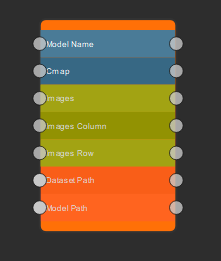
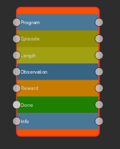
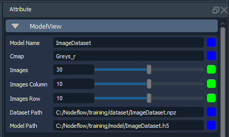

# Nodeflow - Nodes
Templates for creating nodes in Nodeflow A.I.

Nodes are the base form of information in Nodeflow. You can create any type of data and the Attribute window will display the type of information.
There are two key classes for each node created, the node class which will create the node parameters and the action class.

The best way to build a new node is to start with the default node and rename the file and classes to match untill we build a node build interface.

## Nodes







- Nodes encapulate groups of data together ready to be executed. 


## Node Setup

  - File -  ``` my_new_node.py```
  - Node - ``` class MyNewNode(QWidget): ```
  - Action - ``` class MyNewNodeAction(QWidget): ```
  - Update - ``` class MyNewNodeUpdate(QWidget): ```


## Node Code
String
```
nodeflow_main.createAttribute(node=n, name='Model_Name', preset='String', socket=True, plug=True, dataType='str', dataAttr='')
```
Integer
```
nodeflow_main.createAttribute(node=n, name='Epochs', preset='Integer', socket=True, plug=True, dataType='int', dataAttr=1)
```
Float
```
nodeflow_main.createAttribute(node=n, name='Aspect_Ratio', preset='Float', socket=True, plug=True, dataType='flt', dataAttr=1.0)
```
Image
```
nodeflow_main.createAttribute(node=n, name='Image_Dir', preset='Image', socket=True, plug=True, dataType='img', dataAttr='')
```
## Node Example Code
Nodes are created depending on the data required.
```
class MyNewNode(QWidget):
    def __init__(self, nodeflow_main, n, nn, config):
        super(MyNewNode, self).__init__()

        DATASETS = config.get('DATASETS')
        CHECKPOINTS = config.get('CHECKPOINTS')
        RESULTS = config.get('RESULTS')

        name = 'temp_pix2pix'
        dataroot = DATASETS+'mini_pix2pix'

        nodeflow_main.createAttribute(node=n, name='Name', preset='String', socket=True, plug=True, dataType='str', dataAttr=name)
        nodeflow_main.createAttribute(node=n, name='Data_Path', preset='String', socket=True, plug=True, dataType='str', dataAttr=dataroot)

        nodeflow_main.createAttribute(node=n, name='Checkpoints_Dir', preset='String', socket=True, plug=True, dataType='str', dataAttr=CHECKPOINTS)
        nodeflow_main.createAttribute(node=n, name='Results_Dir', preset='String', socket=True, plug=True, dataType='str', dataAttr=RESULTS)

        nodeflow_main.createAttribute(node=n, name='Aspect_Ratio', preset='Float', socket=True, plug=True, dataType='flt', dataAttr=1.0)

        nodeflow_main.createAttribute(node=n, name='Batch_Size', preset='Integer', socket=True, plug=True, dataType='int', dataAttr=1)
        nodeflow_main.createAttribute(node=n, name='Num_Test', preset='Integer', socket=True, plug=True, dataType='int', dataAttr=1)
        nodeflow_main.createAttribute(node=n, name='GPU', preset='Integer', socket=True, plug=True, dataType='int', dataAttr=0)

```
## Node Action Code
Action oode is executed when the play button is pressed for training models or large calculations.
```
class MyNewNodeAction(QAction):
    """Node Action Function"""

    def __init__(self, attrData, config):
        super(MyNewNodeAction, self).__init__()

        NAME = ' --name ' + attrData.get('Name')
        DATA = ' --dataroot ' + attrData.get('Data_Path')

        CPD = ' --checkpoints_dir ' + attrData.get('Checkpoints_Dir')
        RD = ' --results_dir ' + attrData.get('Results_Dir')

        AR = ' --aspect_ratio ' + str(attrData.get('Aspect_Ratio'))
        NUM = ' --num_test ' + str(attrData.get('Num_Test'))
        GPU = ' --gpu_ids ' + str(attrData.get('GPU'))

        command = 'python modules/PixGan/test.py --model pix2pix'+NAME+DATA+NUM+CPD+RD+AR+GPU
```
## Node Update Code
Update oode is executed when the node is double clicked for realtime updates.

```
class MyNewNodeUpdate(QAction):
    """Node Update Function"""

    def __init__(self, attrData, config):
        super(MyNewNodeUpdate, self).__init__()

        IMAGE = attrData.get('Image_Name')
        BRIGHTNESS = int(attrData.get('Brightness'))
        IMAGES = config.get('IMAGES')

        save_path = IMAGES + 'Bright_' + os.path.basename(IMAGE)
        print(save_path)

        im = Image.open(IMAGE)
        enhancer = ImageEnhance.Brightness(im)
        enhanced_im = enhancer.enhance(BRIGHTNESS)
        self.signal_Brightness.emit(enhanced_im)
        enhanced_im.show()
```

### Run script
```
self.run(command)
```

We are interested in any submittions for creating new types of nodes.
Try create your own and submit them for testing for the oppertunity to work with us.

Look forward to test your submittions.